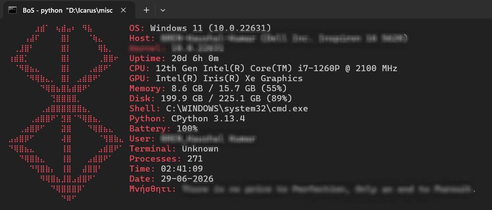

# NeoFetch for Windows

A NeoFetch-inspired command-line system information tool for Windows built in Python.

This project displays detailed system information in the terminal using customizable ASCII art, similar to the original NeoFetch experience on Linux.

## Features

- Displays Windows system information
- Shows CPU, GPU, memory, disk, and battery information
- Displays uptime, shell, Python version, and running processes
- ASCII art output
- Custom color themes
- Terminal customization
- Lightweight and portable Python script

## Screenshot



## Installation

```bash
git clone https://github.com/SuperHax0rr/neofetch-for-windows.git
cd neofetch-for-windows
```

## Requirements

- Python 3.10 or later
- Windows 10/11

## Usage

Run the script directly:

```bash
python neofetch_for_windows.py
```

## Example Output

The script displays information such as:

- Operating System
- Host Information
- Kernel Version
- System Uptime
- CPU Information
- GPU Information
- Memory Usage
- Disk Usage
- Shell Information
- Python Version
- Battery Status
- Logged-in User
- Running Processes
- Current Date and Time

## Technologies Used

- Python
- Windows Management Instrumentation (WMIC)
- ctypes
- subprocess
- platform
- Standard Python Libraries

## Future Improvements

- Additional themes and color schemes
- More hardware information detection
- Network information support
- Optional package manager information
- Configurable themes and ASCII art

## License

This project is licensed under the MIT License.
