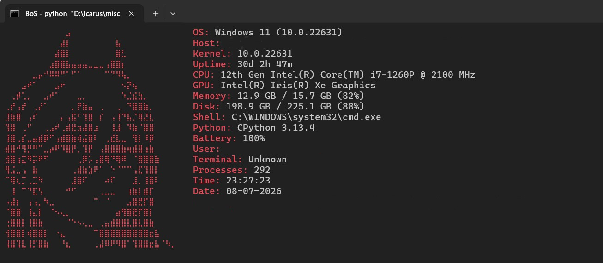
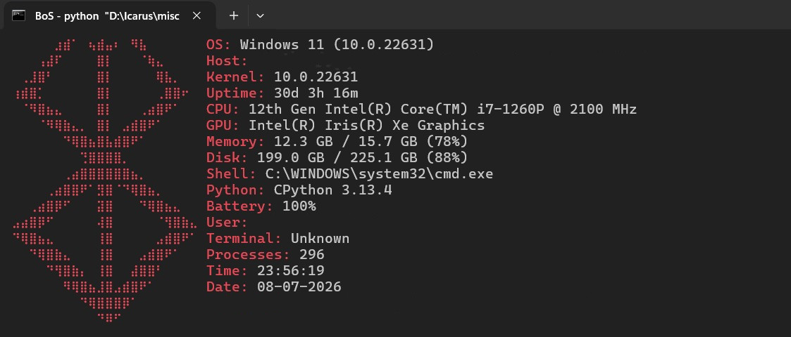

# NeoFetch for Windows

A NeoFetch-inspired command-line system information tool for Windows built in Python.
This will show system information in the terminal with "customizable" ASCII art, similar to the original NeoFetch experience on Linux.

## Features

- Displays Windows system information
- Shows CPU, GPU, memory, disk, and battery information
- Displays uptime, shell, Python version, and running processes
- ASCII art output (change in code as per need)
- Custom color themes (easy to change in code)
- Terminal customization
- Lightweight Python script

## Screenshots




# Installation

Download the latest `NeoFetch4Windows.exe` from the Releases page.
No Python installation is required.

# Usage

Double-click `NeoFetch4Windows.exe`
or run it from Command Prompt:
```cmd
NeoFetch4Windows.exe
```

## Running from source

Requirements

- Python 3.10+
- Windows 10/11

```cmd
git clone https://github.com/yourusername/NeoFetch4Windows.git
cd NeoFetch4Windows
python NeoFetch4Windows.py
```

## Usage

Run the script directly:
```bash
python neofetch_for_windows.py
```

## Example Output

The script displays information such as:

- Operating System
- Host Information
- Kernel Version
- System Uptime
- CPU Information
- GPU Information
- Memory Usage
- Disk Usage
- Shell Information
- Python Version
- Battery Status
- Logged-in User
- Running Processes
- Current Date and Time

## Note

This project is mostly vibe-coded to fetch system details with Ascii art on the side.

## License

This project is licensed under the MIT License.
